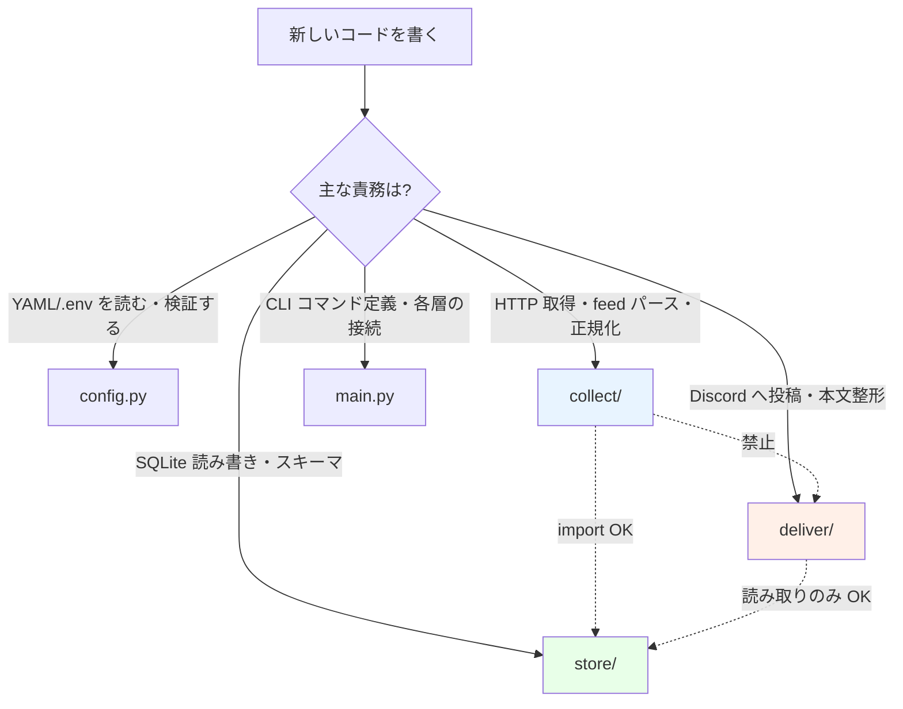
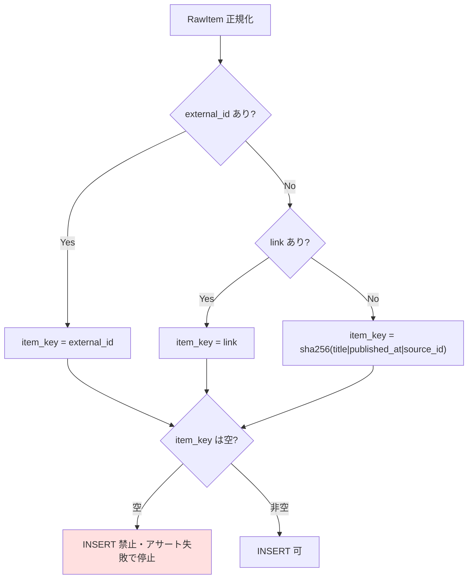
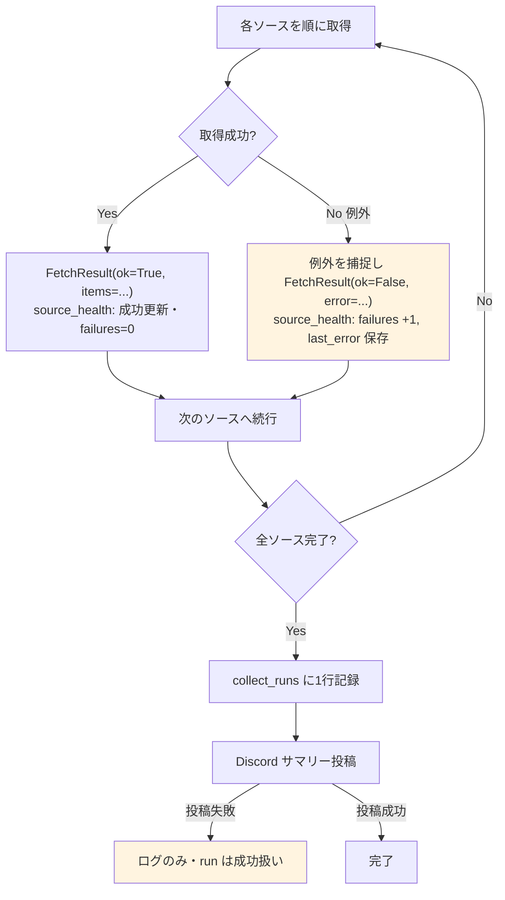
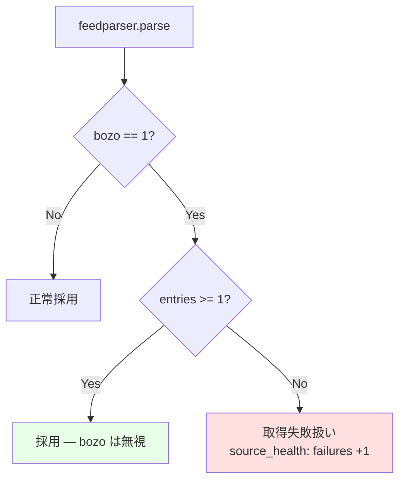
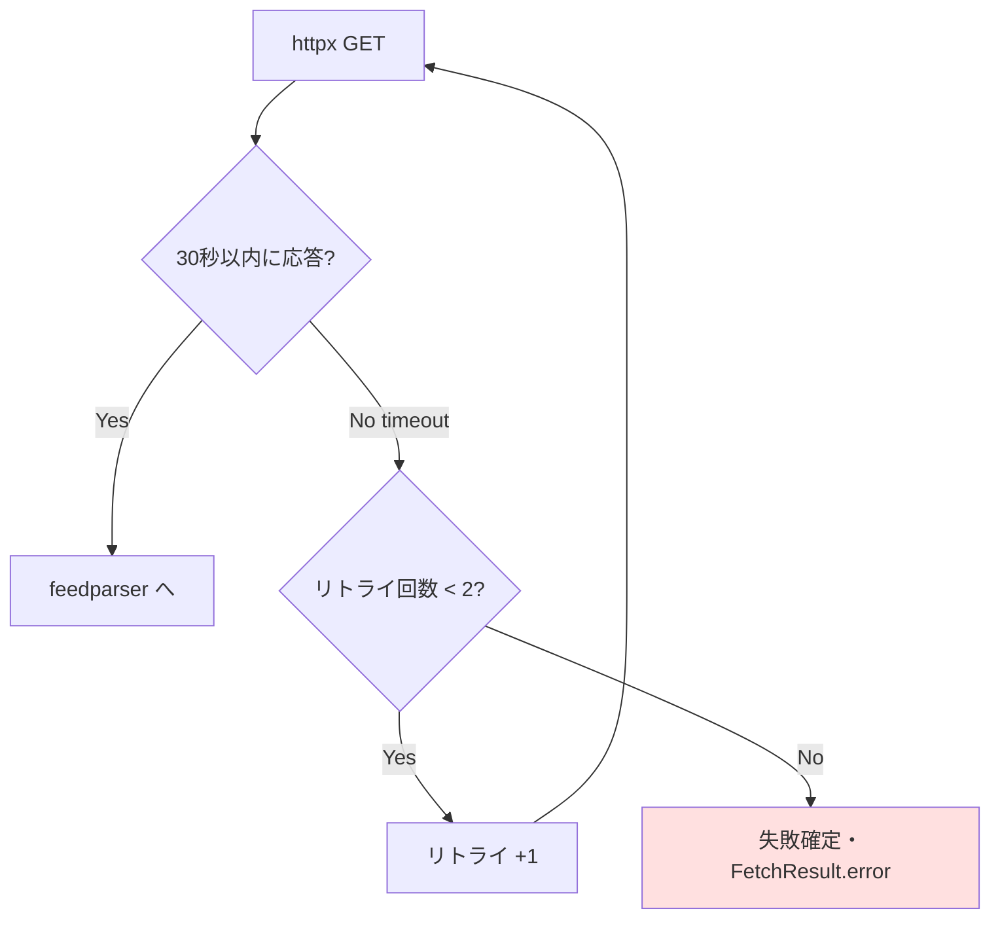
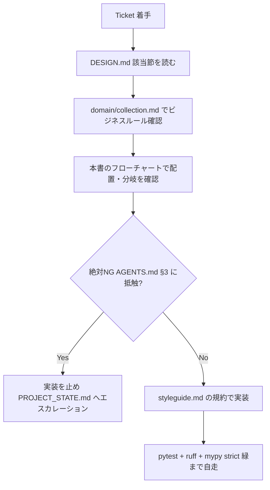

# アーキテクチャ — karyu-tech-news

> 役割: **AI エージェントと実装者が「このコードはどこに置くか / この分岐はどう判断するか」を自力で引けるようにする**知識ベース。判断基準はフローチャートで提示する。
> 参照: [DESIGN.md](./DESIGN.md) (Sprint 1A 単一の真実の源), [design-inheritance-tc-newsflow.md](./design-inheritance-tc-newsflow.md), [domain/collection.md](./domain/collection.md)
> スコープ: Sprint 1A (収集基盤)。LLM/TTS/動画層は将来追記。

---

## 1. レイヤー構造と責務

```
config/   ─┐
           ├─→ collect/ ─→ store/ ←─ deliver/
main.py ───┘                ▲
(CLI)      逆向き依存を禁止。deliver は store の読み取りのみ
```

| レイヤー | モジュール | 責務 | import してよい | import 禁止 |
|---|---|---|---|---|
| **設定** | `config.py` | YAML/.env ロード、Pydantic スキーマ、純関数 | (なし) | collect/store/deliver |
| **収集** | `collect/fetcher.py` `normalize.py` `runner.py` | HTTP取得→RawItem正規化→ソース横断統合 | config, store | **deliver** |
| **永続化** | `store/schema.py` `repo.py` | SQLAlchemy: items/sources/source_health/collect_runs | config | collect, deliver |
| **配信** | `deliver/discord.py` | Webhook POST + サマリー整形 | config, **store の読み取りのみ** | collect |
| **CLI** | `main.py` | typer エントリ、各層のオーケストレーション | 全層 | — |

**鉄則**: `collect → store ← deliver`。`deliver` が `collect` を、`store` が `collect`/`deliver` を import したら設計違反 ([DESIGN.md](./DESIGN.md) §3.2)。表示/配信層がドメインを汚染すると CLI とバッチで挙動が割れる ([design-inheritance §1](./design-inheritance-tc-newsflow.md))。

## 2. 判断基準フローチャート

### 2.1 「この新しいコードはどこに置くか?」



迷ったら「この関数は何に依存するか」で決める。複数層にまたがるなら関数を分割する (高凝集・低結合、1ファイル 200-400 行)。

### 2.2 item_key 生成 (FR-021・絶対不変)



**この優先順位を変えてはならない**。空の item_key を書き込んではならない (書き込み直前にアサート)。

### 2.3 fail-open (FR-060/061/071・耐障害性の核)



**1ソースの例外でループを抜けてはならない**。例外は必ず `FetchResult` に包む。**Webhook 失敗で collect を fail させてはならない** — ログに記録のみ。

### 2.4 feedparser bozo 判定 (Spike §6)



`bozo=1` でも `entries >= 1` なら採用する (誤検知が多いため)。`huxiu-rss` は `bozo=1` かつ `entries=0` で `enabled: false` 保留中。

### 2.5 タイムアウト・リトライ (FR-012/013)



各取得 30 秒、リトライ最大 2 回。collect 全体は 5 分上限。User-Agent は `karyu-tech-news/0.1` を明示 (FR-014)。

## 3. データフロー (Sprint 1A)

```
sources.yaml (enabled=true のみ)
   │ load_sources()
   ▼
[collect] httpx + feedparser → FetchResult[] → RawItem[]
   │ 正規化 (item_key, canonical_url_hash 生成)
   ▼
[store]  SQLite: UNIQUE(source_id, item_key) で dedupe
   │       source_health 更新 / collect_runs 記録
   ▼
[deliver] collect_runs + source_health を読み取り → Discord サマリー
```

ステージ名 (`collect → store → health → summary`) は構造化ログで安定させ、将来の TUI/Discord 進捗表示に流用する ([design-inheritance §12](./design-inheritance-tc-newsflow.md))。

## 4. RSSHub 展開 (ADR-0004)

`sources.yaml` の `http://localhost:1200/...` は `.env` の `RSSHUB_BASE_URL` で展開する。RSSHub はセルフホスト (`docker compose up -d rsshub`)。Tier3 掘金ルートが対象。ルート破壊は fail-open で吸収し、3 連続失敗で Discord 警告 (FR-052)。

## 5. 段階的展開と層の追加予定

| Sprint | 追加レイヤー | 主な責務 |
|---|---|---|
| **1A (現在)** | config / collect / store / deliver | 収集→SQLite→Discord サマリー |
| 1B | `edit/` `script/` `llm/` | スコアリング・tone判定・アーク配置・台本生成 ([design-inheritance §4](./design-inheritance-tc-newsflow.md)) |
| 2 | `tts/` `mix/` | Irodori-TTS 文単位合成・BGM/ジングルミックス |
| 3 | `video/` `publish/` | 波形動画・YouTube 限定公開 |

新レイヤーも §1 の逆向き依存禁止に従う。`edit` は `store` を読むが `deliver` を import しない、等。長期の完パケパイプライン全体像は [architecture-podcast-station.md](./architecture-podcast-station.md) §4。

## 6. 実装着手前チェック (AI エージェント向け)


