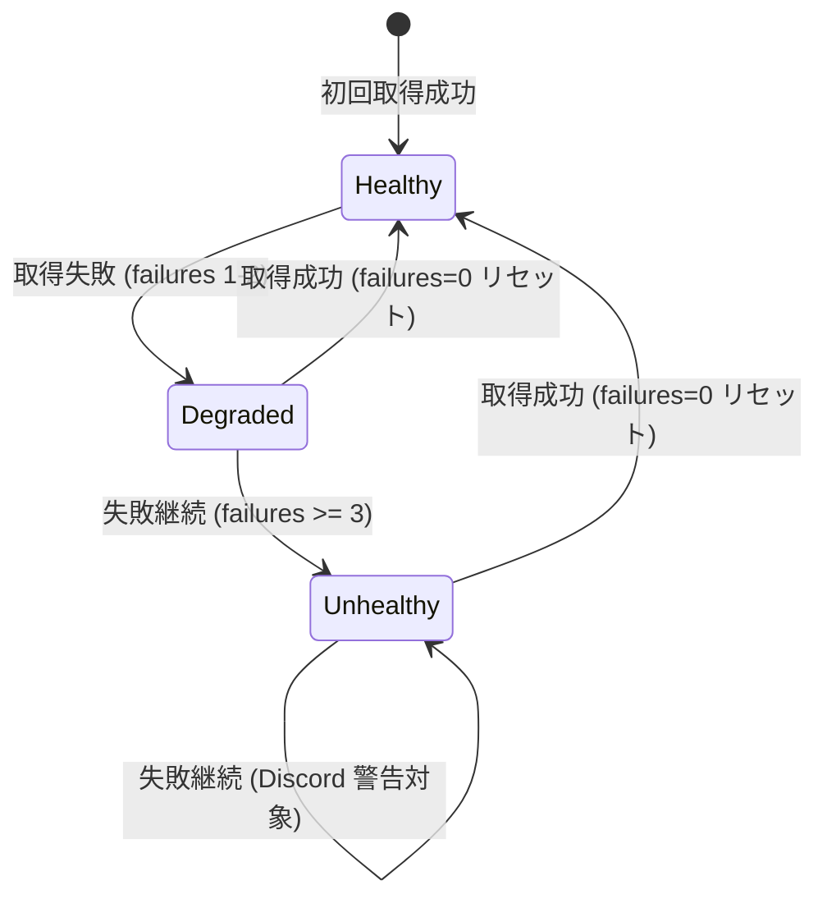
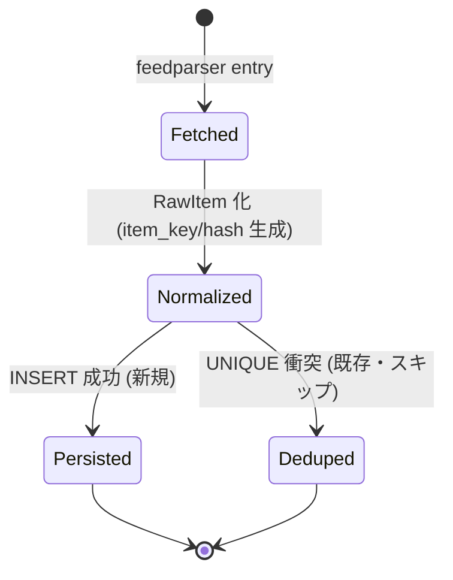
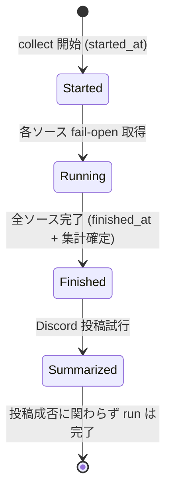

# ドメイン: 収集 (Collection)

> 役割: Sprint 1A の境界づけられたコンテキスト「収集」の**ユビキタス言語・ビジネスルール・状態遷移**を定義する。AI/実装者がドメイン用語を誤用しないための辞書。
> 参照: [DESIGN.md](../DESIGN.md) §3.3/§4, [architecture.md](../architecture.md), [requirements-v1.0.md](../requirements-v1.0.md) §8/§12, [editorial-policy.md](../editorial-policy.md)
> 命名規則は [styleguide.md](../styleguide.md) を参照。

---

## 1. 境界づけられたコンテキスト

Sprint 1A の単一コンテキストは **「収集 (Collection)」** のみ。`edit`/`script`/`tts`/`publish` は将来 Sprint の別コンテキストで、本書では扱わない (作るなら `docs/domain/editing.md` 等を別途追加)。

## 2. ユビキタス言語 (用語辞書)

| 用語 | 英語/コード | 定義 | 出典 |
|---|---|---|---|
| ソース | `Source` / `SourceConfig` | RSS/RSSHub フィードの定義。id/name/url/tier/category/enabled 等 | FR-001 |
| 信頼性階層 | `Tier` (1-4) | 公式(1)/準公式(2)/コミュニティ(3)/噂(4)。採用条件と重みを決める | §6, editorial-policy §3 |
| カテゴリ | `SourceCategory` | AI/Tech/Game/Subculture/OSS/Anime の主題分類 | config.py |
| アイテム | `Item` / `RawItem` | 取得した記事・リリース・投稿の1件 | FR-020 |
| アイテムキー | `item_key` | ソース内でアイテムを一意化する文字列。dedupe の鍵 | FR-021 |
| 正規URLハッシュ | `canonical_url_hash` | 正規化 URL の sha256。**1A では保持のみ**、クロスソース重複検出は 1B | FR-022 |
| ソース健全性 | `source_health` | ソース毎の成功/失敗履歴と連続失敗回数 | FR-033 |
| 収集実行 | `collect_run` | 1回の collect バッチの集計記録 | FR-034 |
| 取得結果 | `FetchResult` | 1ソース取得の成否・items・error・所要時間を包む値オブジェクト | DESIGN §3.3 |
| fail-open | — | 1ソース失敗で全体を止めない設計。Webhook 失敗も run を fail させない | FR-060/071 |
| 採否判定 | ADOPT/EMPTY/DEFER | Spike でのソース検証結果。採用/空(監視)/保留 | spike §7 |
| 連続失敗 | `consecutive_failures` | 直近で連続した失敗回数。3 以上で Discord 警告 | FR-052 |

**表現の統一**: コード内識別子は英語 (`item_key`)、ドキュメント地の文は日本語可だが、初出で対応コード名を併記する。

## 3. 集約 (Aggregates)

Sprint 1A の集約は3つ。集約をまたぐ整合性は collect_run 単位のバッチで担保し、トランザクション境界は集約内に閉じる。

### 3.1 Source 集約 (集約ルート: `Source`)
- **構成**: `Source` (ルート) + `SourceHealth` (1:1、ルートのライフサイクルに従属)
- **不変条件**:
  - `id` は全ソースで一意 (`^[a-z0-9][a-z0-9\-]*$`、1-64字)
  - `tier ∈ {1,2,3,4}`、`category ∈ {AI,Tech,Game,Subculture,OSS,Anime}`
  - `url` は `http://` または `https://` で始まる
- **健全性は Source に従属**: `SourceHealth` を Source と独立に作らない。source_id を外部キーに持つ。

### 3.2 Item 集約 (集約ルート: `Item`)
- **構成**: `Item` 単体 (`source_id` で Source を参照するが、別集約として独立)
- **不変条件**:
  - **`UNIQUE(source_id, item_key)`** — これがソース単位 dedupe の核
  - `item_key` は非空 (空なら INSERT 禁止)
  - `hash` 単体に UNIQUE を張ってはならない (FR-031)
- **クロスソース重複**: 1A では別レコードとして許容。1B で `canonical_url_hash` により同一ネタ検出 (FR-041)。

### 3.3 CollectRun 集約 (集約ルート: `CollectRun`)
- **構成**: `CollectRun` 単体。1回の collect の集計値 (total/successful/failed sources, total/new items)
- **不変条件**: `started_at` 必須、終了時に `finished_at` を埋める。集計値は実際の処理結果と一致する。

> **DDD の重さは持ち込まない** ([styleguide §1](../styleguide.md) Simplicity First): リポジトリは `store/repo.py` の関数群で十分。集約ごとに Repository クラス階層を作る必要はない (Sprint 1A 規模では過剰)。

## 4. ビジネスルール

### 4.1 ソース採用ルール (editorial-policy §3/§4)
| Tier | 単独採用 | 条件 |
|---|---|---|
| 1 公式 | 可 | 企業/大学/政府/GitHub/arXiv の一次情報 |
| 2 準公式 | 可 | 認証アカウント・高信頼メディア (36Kr/量子位/虎嗅) |
| 3 コミュニティ | 要裏取り | 独立2ソースまたは Tier1/2 裏取り推奨 (掘金/知乎) |
| 4 噂 | 原則不採用 | 例外時は独立2ソース必須かつ「噂」明示 |

> Sprint 1A は**収集のみ**で採否判定 (スコアリング) は行わない。本ルールは 1B の編集判定 LLM が使う。1A では全 `enabled` ソースを取得して保存する。

### 4.2 item_key 生成ルール (FR-021)
`external_id` → `link` → `sha256(title|published_at|source_id)` の順で最初に非空のものを採用。([architecture §2.2](../architecture.md) のフローチャート参照)

### 4.3 健全性更新ルール (FR-050/051/052)
- 成功時: `last_success_at` 更新、`consecutive_failures = 0` にリセット
- 失敗時: `last_failure_at` 更新、`consecutive_failures += 1`、`last_error` 保存
- `consecutive_failures >= 3`: Discord 収集サマリーで⚠️警告表示

### 4.4 保持期間ルール (FR-042)
90 日超の `Item` は将来の定期削除対象。**Sprint 1A では削除しない** (実装判断は 1B)。

## 5. 状態遷移

### 5.1 SourceHealth の状態 (consecutive_failures から導出)

> Healthy/Degraded/Unhealthy は **`consecutive_failures` から導出する概念状態**であり、DB に enum カラムとして持たない (派生値を二重管理しない)。`>= 3` が Discord 警告の閾値。

### 5.2 Item のライフサイクル

`Deduped` は新規としてカウントしない (`collect_runs.new_items` は Persisted のみ加算)。

### 5.3 CollectRun のライフサイクル

**run の完了は Discord 投稿成否に依存しない** (fail-open, FR-071)。

## 6. 将来コンテキスト (参考・本書スコープ外)

| コンテキスト | 集約候補 | Sprint |
|---|---|---|
| 編集 (Editing) | TopicCandidate, EpisodeDraft, LlmRun | 1B |
| 台本 (Scripting) | ScriptVersion, Segment | 1B |
| 音声 (Audio) | EpisodeAsset (mp3) | 2 |
| 配信 (Publishing) | PublishJob | 3 |

これらの集約は該当 Sprint 着手時に `docs/domain/<context>.md` として追加する (今は作らない)。
